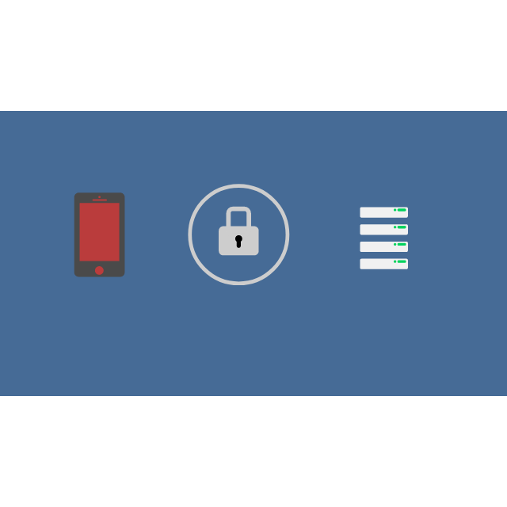
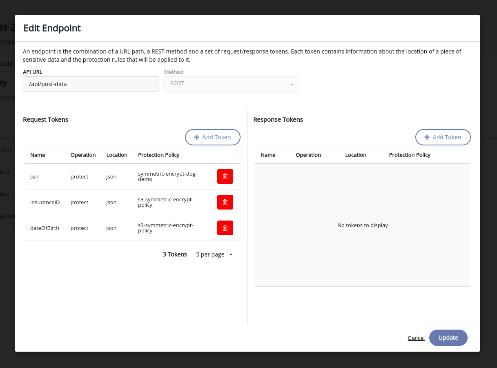

# Data Encryption in Transit

<center>
<sub><sup>Credits - [Creator: Oscar Daniel Martnez Nez](https://lottiefiles.com/68999-file-encryption)</sup></sub>
</center>

This demo shows how you can use a tool like Ciphertrust Data Proection gateway and do field level data encrytion with **no change** to your application's code.

## Pre-requisites
- Deployed Ciphertrust Manager Instance

## How does it work?
### Step 1 - Add side-car container
You need to deploy a sidecar container or an agent that proxies all your requests to your container.

It looks something like this if you use [docker-compose](https://docs.docker.com/compose/).
Note - You can use DPG and Ciphertrust manager with any other Kubernetes or Helm deployment.
```yml
version: '3.1'

services:
  ciphertrust:
    image: thalesgroup/ciphertrust-data-protection-gateway:latest
    container_name: ciphertrust
    environment:
      - REG_TOKEN=<YOUR_DPG_REG_TOKEN>
      - DESTINATION_URL=http://nextjs:3000
      - DPG_PORT=9005
      - TLS_ENABLED=false
      - KMS=<YOUR_CM_IP>
    ports:
      - 80:9005
```

### Step 2 - Configure DPG policies
Setup [DPG policies](https://thalesdocs.com/ctp/cm/latest/admin/adp_ag/adp-prtcn-policy/create-prtcn-policy/index.html) in Ciphertrust Manager to encrypt the fields that are encrypted for your POST requests and add a decrypt policy for your get requests.

This ensures that the proxy takes care of the encryption and decryption and the database finally ONLY gets encrypted data.



### Step 3 - Sit Back and Relax
Let Ciphertrust Manager do all the magic for you while you focus on building great applications.